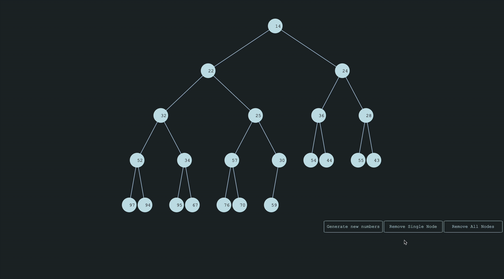
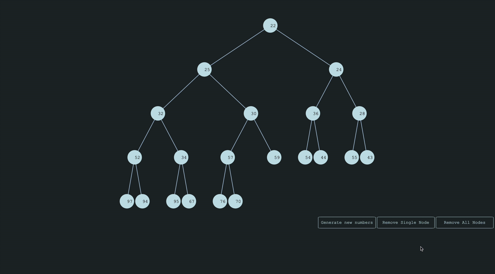

# DynamicTreeVisualisation

This is a project that uses the D3.js library to create a dynamic min-heap visualisation in a node-edge tree diagram. The 

## Heap Insertion
- Visual of heap insertion.

## Regenerate Numbers
- Use of D3 to clear DOM.

## Remove Single Nodes
- Visual of node removal.

## Removal of All Nodes
- Visual of removal of all nodes 

